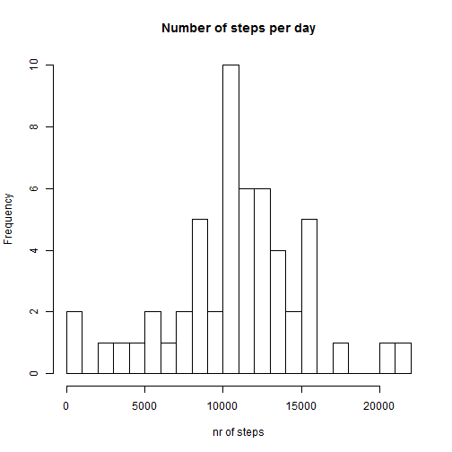
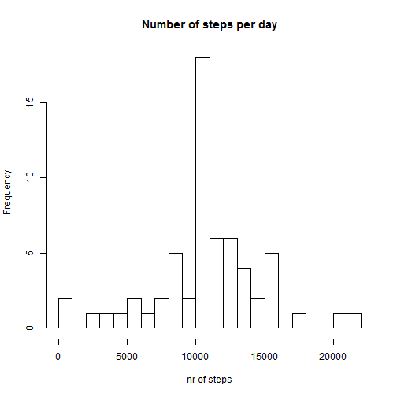
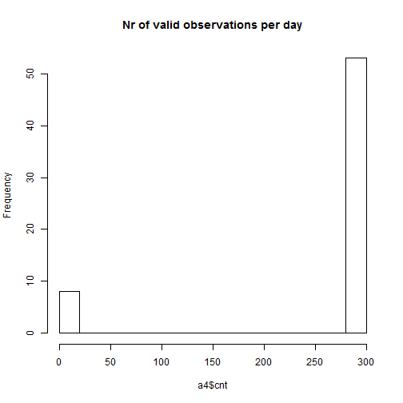
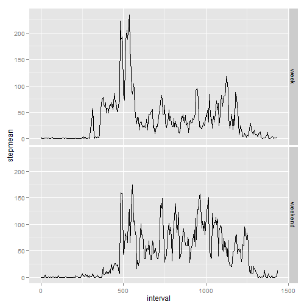

# Reproducible Research: Peer Assessment 1
------------------------------------------

## Loading and preprocessing the data

This mardown describes the analysis of some activity data. The activity file was stored in the current working directory. It contains thre columns: 

- steps: The number of steps in a 5min interval
- date: The day the measurement took place
- interval: the 5 minutes interval id: values are 0,5,10, ... , 55, 100, 105, ... 


```r
activities <- read.table("activity.csv", sep = ",", header = TRUE)
```


In the original file, interval is given in 5min`s per hour, adding an offset of 100 per hour (e.g. value 105 correspond to 1h05).

To make it more readable, I change values so that the value of "interval" gives the minutes since midnight: 


```r
activities$interval <- 60 * (activities$interval - (activities$interval%%100))/100 + 
    (activities$interval%%60)
```


After the transformation, interval-values go from 0 to 1435.

## What is mean total number of steps taken per day?

To calculate the total number of steps per day, I used sqldf to group the data per day and them sum over all steps per day. I store the result in a new variable called a2.


```r
library(sqldf)
```

```
## Loading required package: gsubfn
## Loading required package: proto
## Loading required package: RSQLite
## Loading required package: DBI
## Loading required package: RSQLite.extfuns
```

```r
a2 <- sqldf("select date, sum(steps) as stepsum, count(*) from activities where steps is not null group by date")
```

```
## Loading required package: tcltk
```


The number of steps per day differ widely as the histogram of steps per day over all days shows well.


```r
hist(a2$stepsum, breaks = 20, main = "Number of steps per day", xlab = "nr of steps", 
    ylab = "Frequency")
```

 


The mean and the median are as follows:


```r
# The mean per day
mean(a2$stepsum)
```

```
## [1] 10766
```

```r

# The median per day
median(a2$stepsum)
```

```
## [1] 10765
```


## What is the average daily activity pattern?

To show the average daily activity pattern, I used sqldf again to group the data by interval. To get the average per interval, I took the sql-function avg()


```r
a2 <- sqldf("select interval, avg(steps) as stepmean from activities where steps is not null group by interval")
```


The plot shows well that the subject sleeps at night, but wakes up quite early in the morning. 


```r
plot(a2$interval, a2$stepmean, type = "l", main = "Steps per interval and day (means)", 
    xlab = "interval - from 00:00h to 23:55h", ylab = "mean of steps")
```

 


The interval with the maximum number of steps in five minute interval is given by which.max(), the value can be found b yusing this index of by calling max() directly (what wasn't done this time)


```r
# max Number of steps in a 5 min intervall
which.max(a2$stepmean)
```

```
## [1] 108
```

```r

# value of this interval
a2$stepmean[which.max(a2$stepmean)]
```

```
## [1] 206.2
```


It seems that the persons maximum activity is about 9h in the morning whith more than 200 steps in 5 minutes.

## Imputing missing values

Before doing replacement, I took a look at the data: 


```r
# number of NA's in column 'steps'
sum(is.na(activities$steps))
```

```
## [1] 2304
```

```r

# number of NA's in column 'date'
sum(is.na(activities$date))
```

```
## [1] 0
```

```r

# number of NA's in column 'interval'
sum(is.na(activities$interval))
```

```
## [1] 0
```


Therefore, only values for the variable "steps" must be replaced by better values. 

My strategy to replace NAs with some value is as follows: 

Every time, there is no value (e.g.: is.na(activities$steps)==TRUE), it is replaced by the calculated mean per interval (a2$stepmean).


```r
# make a copy (to make it simpler)
s <- activities$steps

# set all NA`s to 0 in s, otherwise, leave the correct values
s[is.na(activities$steps)] <- 0

# now, add a new column to the original data set: Use the original data if
# available, otherwise, use the calculated stepmean
activities$steps2 <- s + is.na(activities$steps) * a2$stepmean
```


Now, have a look who the distribution may have changed...


```r
a3 <- sqldf("select date, sum(steps2) as stepsum, count(*) from activities where steps2 is not null group by date")
hist(a3$stepsum, breaks = 20, main = "Number of steps per day", xlab = "nr of steps", 
    ylab = "Frequency")
```

 

```r

# The mean per day
mean(a3$stepsum)
```

```
## [1] 10766
```

```r

# The median per day
median(a3$stepsum)
```

```
## [1] 10766
```


The mean stays equal, the median is shifted by one. The reason for this beahviour lies in the fact that NAs only occure when there was no data for a whole day. This can be nicly shown when calculating the number of non-NA-values per day: 


```r
a4 <- sqldf("select date, sum(steps is not null) cnt from activities group by date")
hist(a4$cnt, breaks = 20, main = "Nr of valid observations per day")
```

 


It is now clear, that there are only two types of days: One with 100% missing values and days without missing values. 

Therefore, my strategy implied that the days without observations where replaced by the mean values for a whole day. 

## Are there differences in activity patterns between weekdays and weekends?

This is a bit tricky: I calculated the weekday, then compared it with the nown weekend days (sunday and saturday) to get booleans and then replaces the booleans (as facotors) with the labels "week" and "weekend". 

Note that this code my not very robust because I had to replace german names (due to my german local on my computer)...


```r
activities$weekday <- factor(weekdays(as.Date(activities$date), abbreviate = TRUE))

# note: the weekday is given in the current locale - e.g. in german in my
# case Sa -> saturday, So -> sunday
activities$weekend <- factor(activities$weekday %in% c("Sa", "So"))

levels(activities$weekend) <- c("week", "weekend")

a5 <- sqldf("select interval, avg(steps) as stepmean, weekend from activities group by weekend, interval")
```


Now, plot the two different graphs: As you can see (by example), the subject wakes up later on the weekend. 


```r
library(ggplot2)
qplot(interval, stepmean, data = a5, facets = weekend ~ ., geom = c("line"))
```

 

