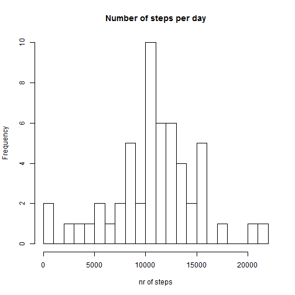
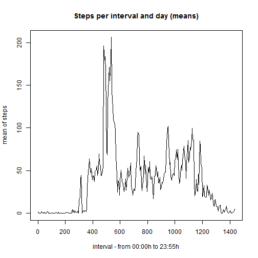
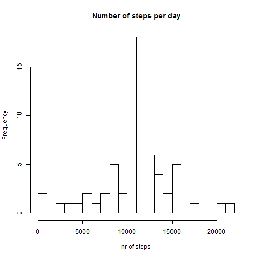
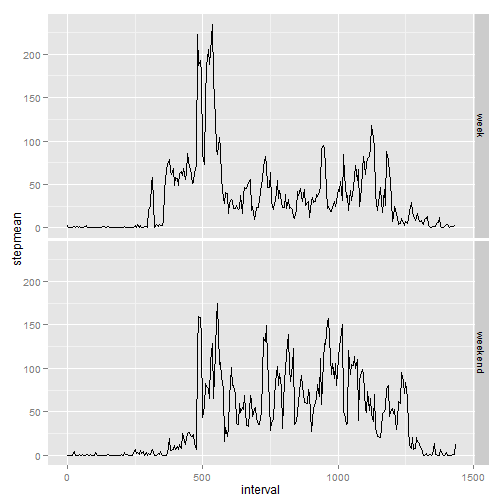

# Reproducible Research: Peer Assessment 1
------------------------------------------

## Loading and preprocessing the data


```r
activities <- read.table("activity.csv", sep = ",", header = TRUE)

# in the original file, interval is given in 5min`s per hour, adding 100 per
# hour I change it so that the value of 'interval' gives the minutes since
# midnight
activities$interval <- 60 * (activities$interval - (activities$interval%%100))/100 + 
    (activities$interval%%60)
```


## What is mean total number of steps taken per day?


```r
library(sqldf)
```

```
## Loading required package: gsubfn
## Loading required package: proto
## Loading required package: RSQLite
## Loading required package: DBI
## Loading required package: RSQLite.extfuns
```

```r
a2 <- sqldf("select date, sum(steps) as stepsum, count(*) from activities where steps is not null group by date")
```

```
## Loading required package: tcltk
```

```r
hist(a2$stepsum, breaks = 20, main = "Number of steps per day", xlab = "nr of steps", 
    ylab = "Frequency")
```

 

```r

# The mean per day
mean(a2$stepsum)
```

```
## [1] 10766
```

```r

# The median per day
median(a2$stepsum)
```

```
## [1] 10765
```


## What is the average daily activity pattern?


```r
a2 <- sqldf("select interval, avg(steps) as stepmean from activities where steps is not null group by interval")
plot(a2$interval, a2$stepmean, type = "l", main = "Steps per interval and day (means)", 
    xlab = "interval - from 00:00h to 23:55h", ylab = "mean of steps")
```

 

```r

# max Number of steps in a 5 min intervall
which.max(a2$stepmean)
```

```
## [1] 108
```

```r

# value of this interval
a2$stepmean[which.max(a2$stepmean)]
```

```
## [1] 206.2
```


## Imputing missing values


```r
# number of NA's in column 'steps'
sum(is.na(activities$steps))
```

```
## [1] 2304
```

```r

# number of NA's in column 'date'
sum(is.na(activities$date))
```

```
## [1] 0
```

```r

# number of NA's in column 'interval'
sum(is.na(activities$interval))
```

```
## [1] 0
```


My strategy to replace NAs with some value is as follows: Every time, is.na(activities$steps) is true, it is replaced by a2$stepmean.


```r
s <- activities$steps

# set all na`s to 0, leave correct values
s[is.na(activities$steps)] <- 0
# set the mean to positions where na's where before
activities$steps2 <- s + is.na(activities$steps) * a2$stepmean
```


```r
a3 <- sqldf("select date, sum(steps2) as stepsum, count(*) from activities where steps2 is not null group by date")
hist(a3$stepsum, breaks = 20, main = "Number of steps per day", xlab = "nr of steps", 
    ylab = "Frequency")
```

 

```r

# The mean per day
mean(a3$stepsum)
```

```
## [1] 10766
```

```r

# The median per day
median(a3$stepsum)
```

```
## [1] 10766
```


The mean stays equal, the median is shifted by one. The reason for this beahviour lies in the fact that NAs only occure when there was no data for a whole day:


```r
a4 <- sqldf("select date, sum(steps is not null) cnt from activities group by date")
hist(a4$cnt, breaks = 20, main = "Nr of valid observations per day")
```

 


Therefore, my strategy implied that the days without observations where replaced by the mean values for a whole day. 

## Are there differences in activity patterns between weekdays and weekends?


```r
activities$weekday <- factor(weekdays(as.Date(activities$date), abbreviate = TRUE))

# note: the weekday is given in the current locale - e.g. in german in my
# case Sa -> saturday, So -> sunday
activities$weekend <- factor(activities$weekday %in% c("Sa", "So"))

levels(activities$weekend) <- c("week", "weekend")

a5 <- sqldf("select interval, avg(steps) as stepmean, weekend from activities group by weekend, interval")

library(ggplot2)
qplot(interval, stepmean, data = a5, facets = weekend ~ ., geom = c("line"))
```

 

